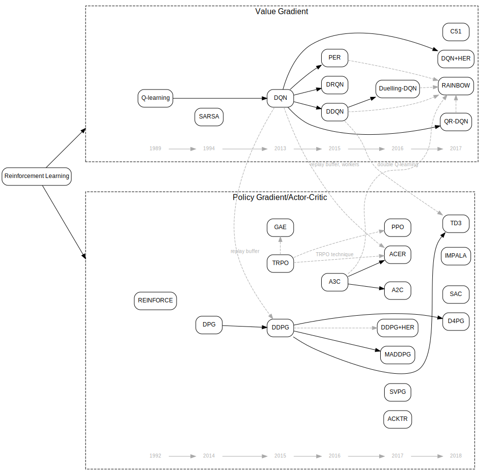

# RL Taxonomy

This is a loose taxonomy of reinforcement learning algorithms. I'm by no means expert in this area, I'm making this as part of my learning process. Note that there are a lot more algorithms than listed here, and often I don't even know how to categorize them. In any case, please PR to correct things or suggest new stuff.

Note that this file is generated by `taxonomy.py`.
#### Table of Contents:

[Taxonomy](#taxonomy) 
[Reinforcement Learning](#ReinforcementLearning)
- [Model Free](#ModelFree)
  - [Value Gradient](#ValueGradient)
    - [SARSA](#SARSA)
    - [Q-learning](#Qlearning)
    - [TD-Gammon](#TDGammon)
    - [DQN](#DQN)
    - [DRQN](#DRQN)
    - [DDQN](#DDQN)
    - [PER](#PER)
    - [Duelling-DQN](#DuellingDQN)
    - [QR-DQN](#QRDQN)
    - [C51](#C51)
    - [RAINBOW](#RAINBOW)
    - [DQN+HER](#DQNHER)
    - [IQN](#IQN)
    - [APE-X DQN](#APEXDQN)
    - [R2D2](#R2D2)
    - [NGU](#NGU)
    - [Agent57](#Agent57)
  - [Policy Gradient/Actor-Critic](#PolicyGradientActorCritic)
    - [REINFORCE](#REINFORCE)
    - [DPG](#DPG)
    - [DDPG](#DDPG)
    - [TRPO](#TRPO)
    - [GAE](#GAE)
    - [A3C](#A3C)
    - [DDPG+HER](#DDPGHER)
    - [MADDPG](#MADDPG)
    - [A2C](#A2C)
    - [ACER](#ACER)
    - [ACKTR](#ACKTR)
    - [PPO](#PPO)
    - [SVPG](#SVPG)
    - [Reactor](#Reactor)
    - [D4PG](#D4PG)
    - [APE-X DDPG](#APEXDDPG)
    - [SAC](#SAC)
    - [TD3](#TD3)
    - [MPO](#MPO)
    - [IMPALA](#IMPALA)
- [Model Based](#ModelBased)
  - [Dyna-Q](#DynaQ)
  - [Prioritized Sweeping](#PrioritizedSweeping)
  - [MCTS](#MCTS)
  - [PILCO](#PILCO)
  - [I2A](#I2A)
  - [MBMF](#MBMF)
  - [Exit](#Exit)
  - [AlphaZero](#AlphaZero)
  - [MVE](#MVE)
  - [STEVE](#STEVE)
  - [ME-TRPO](#METRPO)
  - [MB-MPO](#MBMPO)
  - [World Models](#WorldModels)
  - [PETS](#PETS)
  - [PlaNet](#PlaNet)
  - [SimPLe](#SimPLe)
  - [MuZero](#MuZero)
- [Meta-RL](#MetaRL)
  - [DMRL](#DMRL)
  - [RL^2](#RL2)
  - [MAML](#MAML)
  - [SNAIL](#SNAIL)
  - [ProMP](#ProMP)

## Taxonomy

Below is the taxonomy of reinforcement learning algorithms. Solid line indicates some progression from one idea to another. Dashed line indicates a loose connection. On the bottom you can see the timeline of the publication year of the algorithms. 

It's recommended to open the .SVG file in a new window, as hovering the mouse over the algorithm will show tooltip containing the description of the algorithm and clicking the node will open the link to its description.

## Reinforcement Learning
Reinforcement learning (RL) is an area of machine learning concerned with how software agents ought to take actions in an environment in order to maximize the notion of cumulative reward [from [Wikipedia](https://en.wikipedia.org/wiki/Reinforcement_learning)]

- Related to subsequent ideas:
  - [Model Free](#ModelFree)
  - [Model Based](#ModelBased)
  - [Meta-RL](#MetaRL)
- Useful links:
  - [A (Long) Peek into Reinforcement Learning](https://lilianweng.github.io/lil-log/2018/02/19/a-long-peek-into-reinforcement-learning.html)
  - [(book) Reinforcement Learning: An Introduction - 2nd Edition - Richard S. Sutton and Andrew G. Barto](http://incompleteideas.net/book/the-book.html)
- Videos:
  - [(playlist) Introduction to Reinforcement learning with David Silver](https://www.youtube.com/playlist?list=PLqYmG7hTraZBiG_XpjnPrSNw-1XQaM_gB)
  - [(playlist) Reinforcement Learning Course | DeepMind & UCL](https://www.youtube.com/playlist?list=PLqYmG7hTraZBKeNJ-JE_eyJHZ7XgBoAyb)
  - [(playlist) Reinforcement Learning Tutorials](https://www.youtube.com/playlist?list=PLWzQK00nc192L7UMJyTmLXaHa3KcO0wBT)
  - [(playlist) Deep RL Bootcamp 2017](https://www.youtube.com/playlist?list=PLAdk-EyP1ND8MqJEJnSvaoUShrAWYe51U)
  - [(playlist) CS885 Reinforcement Learning - Spring 2018 - University of Waterloo](https://www.youtube.com/playlist?list=PLdAoL1zKcqTXFJniO3Tqqn6xMBBL07EDc)
  - [(playlist) CS234: Reinforcement Learning | Winter 2019](https://www.youtube.com/playlist?list=PLoROMvodv4rOSOPzutgyCTapiGlY2Nd8u)

### Model Free
(Path: [Reinforcement Learning](#ReinforcementLearning) --> [Model Free](#ModelFree))

In model free reinforcement learning, the agent directly tries to predict the value/policy without having or trying to model the environment

 
#### Value Gradient
(Path: [Reinforcement Learning](#ReinforcementLearning) --> [Model Free](#ModelFree) --> [Value Gradient](#ValueGradient))

The algorithm is learning the value function of each state or state-action. The policy is implicit, usually by just selecting the best value

 
##### SARSA
(Path: [Reinforcement Learning](#ReinforcementLearning) --> [Model Free](#ModelFree) --> [Value Gradient](#ValueGradient) --> [SARSA](#SARSA))

SARSA (State-Action-Reward-State-Action) is an on-policy TD control method

- Paper: http://citeseerx.ist.psu.edu/viewdoc/download?doi=10.1.1.17.2539&rep=rep1&type=pdf
- Authors: G. A. Rummery, M. Niranjan
- Year: 1994
- Flags:
  - On-Policy (ONP)
  - Discrete action space (DA)
- Related to prior idea:
  - [Value Gradient](#ValueGradient)

##### Q-learning
(Path: [Reinforcement Learning](#ReinforcementLearning) --> [Model Free](#ModelFree) --> [Value Gradient](#ValueGradient) --> [Q-learning](#Qlearning))

Q-learning an off-policy TD control method. Unlike SARSA, it doesn't follow the policy to find the next action but rather chooses most optimal action in a greedy fashion

- Paper: http://www.cs.rhul.ac.uk/~chrisw/new_thesis.pdf
- Authors: Chris Watkins
- Year: 1989
- Flags:
  - Off-Policy (OFP)
  - Discrete action space (DA)
- Related to prior idea:
  - [Value Gradient](#ValueGradient)
- Related to subsequent idea:
  - [DQN](#DQN)
- Useful links:
  - [Diving deeper into Reinforcement Learning with Q-Learning](https://www.freecodecamp.org/news/diving-deeper-into-reinforcement-learning-with-q-learning-c18d0db58efe/)
  - [Simple Reinforcement Learning with Tensorflow Part 0: Q-Learning with Tables and Neural Networks](https://medium.com/emergent-future/simple-reinforcement-learning-with-tensorflow-part-0-q-learning-with-tables-and-neural-networks-d195264329d0)

##### TD-Gammon
(Path: [Reinforcement Learning](#ReinforcementLearning) --> [Model Free](#ModelFree) --> [Value Gradient](#ValueGradient) --> [TD-Gammon](#TDGammon))

TD-Gammon is a model-free reinforcement learning algorithm similar to Q-learning, and uses a multi-layer perceptron with one hidden layer as the value function approximator. It learns the game entirely by playing against itself and achieves superhuman level of play.

- Paper: https://dl.acm.org/doi/10.1145/203330.203343
- Authors: Gerald Tesauro
- Year: 1995
- Related to prior idea:
  - [Value Gradient](#ValueGradient)

##### DQN
(Path: [Reinforcement Learning](#ReinforcementLearning) --> [Model Free](#ModelFree) --> [Value Gradient](#ValueGradient) --> [DQN](#DQN))

Deep Q Network (DQN) is Q-Learning with deep neural network as state-action value estimator and uses a replay buffer to sample experiences from previous trajectories to make learning more stable.

- Paper: https://arxiv.org/abs/1312.5602
- Authors: Volodymyr Mnih, Koray Kavukcuoglu, David Silver, Alex Graves, Ioannis Antonoglou, Daan Wierstra, Martin Riedmiller
- Year: 2013
- Flags:
  - Off-Policy (OFP)
  - Continuous state space (CS)
  - Discrete action space (DA)
  - Replay Buffer (RB)
- Related to prior idea:
  - [Q-learning](#Qlearning)
- Related to subsequent ideas:
  - [DRQN](#DRQN)
  - [DDQN](#DDQN)
  - [PER](#PER)
  - [QR-DQN](#QRDQN)
  - [C51](#C51)
  - [DQN+HER](#DQNHER)
  - [IQN](#IQN)
  - [APE-X DQN](#APEXDQN)
  - [R2D2](#R2D2)
  - [DDPG](#DDPG) (replay buffer)
  - [ACER](#ACER) (replay buffer)
- Useful links:
  - [(tutorial) Deep Q Learning for the CartPole](https://towardsdatascience.com/deep-q-learning-for-the-cartpole-44d761085c2f)
  - [An introduction to Deep Q-Learning: let’s play Doom](https://www.freecodecamp.org/news/an-introduction-to-deep-q-learning-lets-play-doom-54d02d8017d8/)

##### DRQN
(Path: [Reinforcement Learning](#ReinforcementLearning) --> [Model Free](#ModelFree) --> [Value Gradient](#ValueGradient) --> [DRQN](#DRQN))

Deep Recurrent Q-Learning. Adding recurrency to a Deep Q-Network (DQN) by replacing the first post-convolutional fully-connected layer with a recurrent LSTM

- Paper: https://arxiv.org/abs/1507.06527
- Authors: Matthew Hausknecht, Peter Stone
- Year: 2015
- Flags:
  - Off-Policy (OFP)
  - Continuous state space (CS)
  - Discrete action space (DA)
  - Replay Buffer (RB)
  - Recurrent Neural Network (RNN)
- Related to prior idea:
  - [DQN](#DQN)

##### DDQN
(Path: [Reinforcement Learning](#ReinforcementLearning) --> [Model Free](#ModelFree) --> [Value Gradient](#ValueGradient) --> [DDQN](#DDQN))

Double DQN adds another neural network, making separate network for policy and target. The target network is only updated after certain number of steps/episodes. This makes the learning more stable.

- Paper: https://arxiv.org/abs/1509.06461
- Authors: Hado van Hasselt, Arthur Guez, David Silver
- Year: 2015
- Flags:
  - Off-Policy (OFP)
  - Continuous state space (CS)
  - Discrete action space (DA)
- Related to prior idea:
  - [DQN](#DQN)
- Related to subsequent ideas:
  - [Duelling-DQN](#DuellingDQN)
  - [RAINBOW](#RAINBOW)
  - [TD3](#TD3) (double Q-learning)
- Useful links:
  - [(tutorial) Deep Q Learning for the CartPole](https://towardsdatascience.com/deep-q-learning-for-the-cartpole-44d761085c2f)

##### PER
(Path: [Reinforcement Learning](#ReinforcementLearning) --> [Model Free](#ModelFree) --> [Value Gradient](#ValueGradient) --> [PER](#PER))

Prioritized Experience Replay (PER) improves data efficiency by replaying transitions from which there is more to learn more often

- Paper: https://arxiv.org/abs/1511.05952
- Authors: Tom Schaul, John Quan, Ioannis Antonoglou, David Silver
- Year: 2015
- Flags:
  - Off-Policy (OFP)
  - Continuous state space (CS)
  - Discrete action space (DA)
  - Replay Buffer (RB)
- Related to prior idea:
  - [DQN](#DQN)
- Related to subsequent idea:
  - [RAINBOW](#RAINBOW)

##### Duelling-DQN
(Path: [Reinforcement Learning](#ReinforcementLearning) --> [Model Free](#ModelFree) --> [Value Gradient](#ValueGradient) --> [Duelling-DQN](#DuellingDQN))

Duelling DQN represents two separate estimators: one for the state value function and one for the state-dependent action advantage function. The main benefit of this factoring is to generalize learning across actions without imposing any change to the underlying reinforcement learning algorithm.

- Paper: https://arxiv.org/abs/1511.06581
- Authors: Ziyu Wang, Tom Schaul, Matteo Hessel, Hado van Hasselt, Marc Lanctot, Nando de Freitas
- Year: 2016
- Flags:
  - Off-Policy (OFP)
  - Continuous state space (CS)
  - Discrete action space (DA)
- Related to prior idea:
  - [DDQN](#DDQN)
- Related to subsequent idea:
  - [RAINBOW](#RAINBOW)

##### QR-DQN
(Path: [Reinforcement Learning](#ReinforcementLearning) --> [Model Free](#ModelFree) --> [Value Gradient](#ValueGradient) --> [QR-DQN](#QRDQN))

Distributional Reinforcement Learning with Quantile Regression (QR-DQN). In QR-DQN, distribution of values values are used for each state-action pair instead of a single mean value

- Paper: https://arxiv.org/abs/1710.10044
- Authors: Will Dabney, Mark Rowland, Marc G. Bellemare, Rémi Munos
- Year: 2017
- Flags:
  - Off-Policy (OFP)
  - Continuous state space (CS)
  - Discrete action space (DA)
  - Replay Buffer (RB)
  - Distributional (DI)
- Related to prior idea:
  - [DQN](#DQN)
- Related to subsequent idea:
  - [RAINBOW](#RAINBOW)
- Useful links:
  - [(GitHub) Quantile Regression DQN](https://github.com/senya-ashukha/quantile-regression-dqn-pytorch)

##### C51
(Path: [Reinforcement Learning](#ReinforcementLearning) --> [Model Free](#ModelFree) --> [Value Gradient](#ValueGradient) --> [C51](#C51))

C51 Algorithm. The core idea of Distributional Bellman is to ask the following questions. If we can model the Distribution of the total future rewards, why restrict ourselves to the expected value (i.e. Q function)? There are several benefits to learning an approximate distribution rather than its approximate expectation. [[source: flyyufelix's blog](https://flyyufelix.github.io/2017/10/24/distributional-bellman.html)]

- Paper: https://arxiv.org/abs/1707.06887
- Authors: Marc G. Bellemare, Will Dabney, Rémi Munos
- Year: 2017
- Flags:
  - Off-Policy (OFP)
  - Continuous state space (CS)
  - Discrete action space (DA)
  - Replay Buffer (RB)
  - Distributional (DI)
- Related to prior idea:
  - [DQN](#DQN)
- Useful links:
  - [Distributional Bellman and the C51 Algorithm](https://flyyufelix.github.io/2017/10/24/distributional-bellman.html)

##### RAINBOW
(Path: [Reinforcement Learning](#ReinforcementLearning) --> [Model Free](#ModelFree) --> [Value Gradient](#ValueGradient) --> [RAINBOW](#RAINBOW))

Combines six DQN extensions, namely Double Q-Learning, prioritized replay, dueling networks, multi-step learning, distributional DQN, and noisy DQN into single model to achieve state of the art performance

- Paper: https://arxiv.org/abs/1710.02298
- Authors: Matteo Hessel, Joseph Modayil, Hado van Hasselt, Tom Schaul, Georg Ostrovski, Will Dabney, Dan Horgan, Bilal Piot, Mohammad Azar, David Silver
- Year: 2017
- Flags:
  - Off-Policy (OFP)
  - Continuous state space (CS)
  - Discrete action space (DA)
  - Replay Buffer (RB)
- Related to prior ideas:
  - [DDQN](#DDQN)
  - [PER](#PER)
  - [Duelling-DQN](#DuellingDQN)
  - [QR-DQN](#QRDQN)
  - [A3C](#A3C)

##### DQN+HER
(Path: [Reinforcement Learning](#ReinforcementLearning) --> [Model Free](#ModelFree) --> [Value Gradient](#ValueGradient) --> [DQN+HER](#DQNHER))

DQN with Hindsight Experience Replay (HER)

- Paper: https://arxiv.org/abs/1707.01495
- Authors: Marcin Andrychowicz, Filip Wolski, Alex Ray, Jonas Schneider, Rachel Fong, Peter Welinder, Bob McGrew, Josh Tobin, Pieter Abbeel, Wojciech Zaremba
- Year: 2017
- Flags:
  - Off-Policy (OFP)
  - Continuous state space (CS)
  - Discrete action space (DA)
  - Replay Buffer (RB)
- Related to prior idea:
  - [DQN](#DQN)
- Related to subsequent idea:
  - [DDPG+HER](#DDPGHER) (HER)
- Useful links:
  - [Learning from mistakes with Hindsight Experience Replay](https://becominghuman.ai/learning-from-mistakes-with-hindsight-experience-replay-547fce2b3305)

##### IQN
(Path: [Reinforcement Learning](#ReinforcementLearning) --> [Model Free](#ModelFree) --> [Value Gradient](#ValueGradient) --> [IQN](#IQN))

Implicit Quantile Networks (IQN). From the abstract: In this work, we build on recent advances in distributional reinforcement learning to give a generally applicable, flexible, and state-of-the-art distributional variant of DQN. We achieve this by using quantile regression to approximate the full quantile function for the state-action return distribution. By reparameterizing a distribution over the sample space, this yields an implicitly defined return distribution and gives rise to a large class of risk-sensitive policies. We demonstrate improved performance on the 57 Atari 2600 games in the ALE, and use our algorithm's implicitly defined distributions to study the effects of risk-sensitive policies in Atari games. 
           

- Paper: https://arxiv.org/abs/1806.06923
- Authors: Will Dabney, Georg Ostrovski, David Silver, Rémi Munos
- Year: 2018
- Flags:
  - Off-Policy (OFP)
  - Continuous state space (CS)
  - Discrete action space (DA)
  - Replay Buffer (RB)
  - Distributional (DI)
- Related to prior idea:
  - [DQN](#DQN)
- Useful links:
  - [(StackExchange) How does Implicit Quantile-Regression Network (IQN) differ from QR-DQN?](https://datascience.stackexchange.com/questions/40874/how-does-implicit-quantile-regression-network-iqn-differ-from-qr-dqn)

##### APE-X DQN
(Path: [Reinforcement Learning](#ReinforcementLearning) --> [Model Free](#ModelFree) --> [Value Gradient](#ValueGradient) --> [APE-X DQN](#APEXDQN))

DQN with Distributed Prioritized Experience Replay

- Paper: https://arxiv.org/abs/1803.00933
- Authors: Dan Horgan, John Quan, David Budden, Gabriel Barth-Maron, Matteo Hessel, Hado van Hasselt, David Silver
- Year: 2018
- Flags:
  - Off-Policy (OFP)
  - Continuous state space (CS)
  - Discrete action space (DA)
  - Replay Buffer (RB)
- Related to prior idea:
  - [DQN](#DQN)
- Related to subsequent idea:
  - [APE-X DDPG](#APEXDDPG) (APE-X)
- Useful links:
  - [Understanding and Implementing Distributed Prioritized Experience Replay (Horgan et al., 2018)](https://towardsdatascience.com/understanding-and-implementing-distributed-prioritized-experience-replay-horgan-et-al-2018-d2c1640e0520)

##### R2D2
(Path: [Reinforcement Learning](#ReinforcementLearning) --> [Model Free](#ModelFree) --> [Value Gradient](#ValueGradient) --> [R2D2](#R2D2))

Recurrent Replay Distributed DQN (R2D2). (from the abstract) Building on the recent successes of distributed training of RL agents, in this paper we investigate the training of RNN-based RL agents from distributed prioritized experience replay. We study the effects of parameter lag resulting in representational drift and recurrent state staleness and empirically derive an improved training strategy. Using a single network architecture and fixed set of hyper-parameters, the resulting agent, Recurrent Replay Distributed DQN, quadruples the previous state of the art on Atari-57, and matches the state of the art on DMLab-30. It is the first agent to exceed human-level performance in 52 of the 57 Atari games.

- Paper: https://openreview.net/forum?id=r1lyTjAqYX
- Authors: Steven Kapturowski, Georg Ostrovski, John Quan, Remi Munos, Will Dabney
- Year: 2019
- Flags:
  - Off-Policy (OFP)
  - Continuous state space (CS)
  - Discrete action space (DA)
  - Replay Buffer (RB)
- Related to prior idea:
  - [DQN](#DQN)
- Related to subsequent idea:
  - [NGU](#NGU)

##### NGU
(Path: [Reinforcement Learning](#ReinforcementLearning) --> [Model Free](#ModelFree) --> [Value Gradient](#ValueGradient) --> [NGU](#NGU))

Never Give Up (NGU). (from the abstract) We propose a reinforcement learning agent to solve hard exploration games by learning a range of directed exploratory policies. We construct an episodic memory-based intrinsic reward using k-nearest neighbors over the agent's recent experience to train the directed exploratory policies, thereby encouraging the agent to repeatedly revisit all states in its environment. A self-supervised inverse dynamics model is used to train the embeddings of the nearest neighbour lookup, biasing the novelty signal towards what the agent can control. We employ the framework of Universal Value Function Approximators (UVFA) to simultaneously learn many directed exploration policies with the same neural network, with different trade-offs between exploration and exploitation. By using the same neural network for different degrees of exploration/exploitation, transfer is demonstrated from predominantly exploratory policies yielding effective exploitative policies. The proposed method can be incorporated to run with modern distributed RL agents that collect large amounts of experience from many actors running in parallel on separate environment instances. Our method doubles the performance of the base agent in all hard exploration in the Atari-57 suite while maintaining a very high score across the remaining games, obtaining a median human normalised score of 1344.0%. Notably, the proposed method is the first algorithm to achieve non-zero rewards (with a mean score of 8,400) in the game of Pitfall! without using demonstrations or hand-crafted features.

- Paper: https://arxiv.org/abs/2002.06038
- Authors: Adrià Puigdomènech Badia, Pablo Sprechmann, Alex Vitvitskyi, Daniel Guo, Bilal Piot, Steven Kapturowski, Olivier Tieleman, Martín Arjovsky, Alexander Pritzel, Andew Bolt, Charles Blundell
- Year: 2020
- Flags:
  - Off-Policy (OFP)
  - Continuous state space (CS)
  - Discrete action space (DA)
  - Replay Buffer (RB)
- Related to prior idea:
  - [R2D2](#R2D2)
- Related to subsequent idea:
  - [Agent57](#Agent57)

##### Agent57
(Path: [Reinforcement Learning](#ReinforcementLearning) --> [Model Free](#ModelFree) --> [Value Gradient](#ValueGradient) --> [Agent57](#Agent57))

(from the abstract) Atari games have been a long-standing benchmark in the reinforcement learning (RL) community for the past decade. This benchmark was proposed to test general competency of RL algorithms. Previous work has achieved good average performance by doing outstandingly well on many games of the set, but very poorly in several of the most challenging games. We propose Agent57, the first deep RL agent that outperforms the standard human benchmark on all 57 Atari games. To achieve this result, we train a neural network which parameterizes a family of policies ranging from very exploratory to purely exploitative. We propose an adaptive mechanism to choose which policy to prioritize throughout the training process. Additionally, we utilize a novel parameterization of the architecture that allows for more consistent and stable learning.

- Paper: https://arxiv.org/abs/2003.13350
- Authors: Adrià Puigdomènech Badia, Bilal Piot, Steven Kapturowski, Pablo Sprechmann, Alex Vitvitskyi, Daniel Guo, Charles Blundell
- Year: 2020
- Flags:
  - Off-Policy (OFP)
  - Continuous state space (CS)
  - Discrete action space (DA)
  - Replay Buffer (RB)
- Related to prior idea:
  - [NGU](#NGU)
- Useful links:
  - [DeepMind Unveils Agent57, the First AI Agents that Outperforms Human Benchmarks in 57 Atari Games](https://towardsdatascience.com/deepmind-unveils-agent57-the-first-ai-agents-that-outperforms-human-benchmarks-in-57-atari-games-35db4282dab3)

#### Policy Gradient/Actor-Critic
(Path: [Reinforcement Learning](#ReinforcementLearning) --> [Model Free](#ModelFree) --> [Policy Gradient/Actor-Critic](#PolicyGradientActorCritic))

The algorithm works directly to optimize the policy, with or without value function. If the value function is learned in addition to the policy, we would get Actor-Critic algorithm. Most policy gradient algorithms are Actor-Critic. The *Critic* updates value function parameters *w* and depending on the algorithm it could be action-value ***Q(a|s;w)*** or state-value ***V(s;w)***. The *Actor* updates policy parameters θ, in the direction suggested by the critic, ***π(a|s;θ)***. [from [Lilian Weng' blog](https://lilianweng.github.io/lil-log/2018/02/19/a-long-peek-into-reinforcement-learning.html)]

- Useful links:
  - [Policy Gradient Algorithms](https://lilianweng.github.io/lil-log/2018/04/08/policy-gradient-algorithms.html)
  - [RL — Policy Gradient Explained](https://medium.com/@jonathan_hui/rl-policy-gradients-explained-9b13b688b146)
  - [Going Deeper Into Reinforcement Learning: Fundamentals of Policy Gradients](https://danieltakeshi.github.io/2017/03/28/going-deeper-into-reinforcement-learning-fundamentals-of-policy-gradients/)
  - [An introduction to Policy Gradients with Cartpole and Doom](https://www.freecodecamp.org/news/an-introduction-to-policy-gradients-with-cartpole-and-doom-495b5ef2207f/)

 
##### REINFORCE
(Path: [Reinforcement Learning](#ReinforcementLearning) --> [Model Free](#ModelFree) --> [Policy Gradient/Actor-Critic](#PolicyGradientActorCritic) --> [REINFORCE](#REINFORCE))

REINFORCE (Monte-Carlo policy gradient) is a pure policy gradient algorithm that works without a value function. The agent collects a trajectory of one episode using its current policy, and uses the returns to update the policy parameter

- Paper: https://people.cs.umass.edu/~barto/courses/cs687/williams92simple.pdf
- Authors: Ronald J. Williams
- Year: 1992
- Flags:
  - Monte Carlo (MC)
  - On-Policy (ONP)
  - Continuous state space (CS)
  - Discrete action space (DA)
- Related to prior idea:
  - [Policy Gradient /Actor-Critic](#PolicyGradientActorCritic)
- Useful links:
  - [LearningReinforcementLearningbyLearningREINFORCE (PDF)](http://www.cs.toronto.edu/~tingwuwang/REINFORCE.pdf)
  - [An introduction to Policy Gradients with Cartpole and Doom](https://www.freecodecamp.org/news/an-introduction-to-policy-gradients-with-cartpole-and-doom-495b5ef2207f/)

##### DPG
(Path: [Reinforcement Learning](#ReinforcementLearning) --> [Model Free](#ModelFree) --> [Policy Gradient/Actor-Critic](#PolicyGradientActorCritic) --> [DPG](#DPG))

Deterministic Policy Gradient. Abstract: In this paper we consider deterministic policy gradient algorithms for reinforcement learning with continuous actions. The deterministic policy gradient has a particularly appealing form: it is the expected gradient of the action-value function. This simple form means that the deterministic policy gradient can be estimated much more efficiently than the usual stochastic policy gradient. To ensure adequate exploration, we introduce an off-policy actor-critic algorithm that learns a deterministic target policy from an exploratory behaviour policy. We demonstrate that deterministic policy gradient algorithms can significantly outperform their stochastic counterparts in high-dimensional action spaces.

- Paper: http://proceedings.mlr.press/v32/silver14.pdf
- Authors: David Silver, Guy Lever, Nicolas Heess, Thomas Degris, Daan Wierstra, Martin Riedmiller
- Year: 2014
- Flags:
  - Off-Policy (OFP)
  - Continuous state space (CS)
  - Continuous action space (CA)
  - Deterministic Policy (DP)
- Related to prior idea:
  - [Policy Gradient /Actor-Critic](#PolicyGradientActorCritic)
- Related to subsequent idea:
  - [DDPG](#DDPG)

##### DDPG
(Path: [Reinforcement Learning](#ReinforcementLearning) --> [Model Free](#ModelFree) --> [Policy Gradient/Actor-Critic](#PolicyGradientActorCritic) --> [DDPG](#DDPG))

Deep Deterministic Policy Gradient (DDPG).

- Paper: https://arxiv.org/abs/1509.02971
- Authors: Timothy P. Lillicrap, Jonathan J. Hunt, Alexander Pritzel, Nicolas Heess, Tom Erez, Yuval Tassa, David Silver, Daan Wierstra
- Year: 2015
- Flags:
  - Off-Policy (OFP)
  - Continuous state space (CS)
  - Continuous action space (CA)
  - Deterministic Policy (DP)
  - Replay Buffer (RB)
- Related to prior ideas:
  - [DPG](#DPG)
  - [DQN](#DQN) (replay buffer)
- Related to subsequent ideas:
  - [DDPG+HER](#DDPGHER)
  - [MADDPG](#MADDPG)
  - [D4PG](#D4PG)
  - [APE-X DDPG](#APEXDDPG)
  - [TD3](#TD3)
- Useful links:
  - [Deep Deterministic Policy Gradient - Spinning Up](https://spinningup.openai.com/en/latest/algorithms/ddpg.html)

##### TRPO
(Path: [Reinforcement Learning](#ReinforcementLearning) --> [Model Free](#ModelFree) --> [Policy Gradient/Actor-Critic](#PolicyGradientActorCritic) --> [TRPO](#TRPO))

Trust Region Policy Optimization (TRPO) improves training stability by enforcing a KL divergence constraint to avoid parameter updates that change the policy too much at one step.

- Paper: https://arxiv.org/pdf/1502.05477
- Authors: John Schulman, Sergey Levine, Philipp Moritz, Michael I. Jordan, Pieter Abbeel
- Year: 2015
- Flags:
  - On-Policy (ONP)
  - Continuous state space (CS)
  - Continuous action space (CA)
  - Advantage (ADV)
- Related to prior idea:
  - [Policy Gradient /Actor-Critic](#PolicyGradientActorCritic)
- Related to subsequent ideas:
  - [GAE](#GAE)
  - [ACER](#ACER) (TRPO technique)
  - [PPO](#PPO)
- Useful links:
  - [RL — Trust Region Policy Optimization (TRPO) Explained](https://medium.com/@jonathan_hui/rl-trust-region-policy-optimization-trpo-explained-a6ee04eeeee9)
  - [RL — Trust Region Policy Optimization (TRPO) Part 2](https://medium.com/@jonathan_hui/rl-trust-region-policy-optimization-trpo-part-2-f51e3b2e373a)

##### GAE
(Path: [Reinforcement Learning](#ReinforcementLearning) --> [Model Free](#ModelFree) --> [Policy Gradient/Actor-Critic](#PolicyGradientActorCritic) --> [GAE](#GAE))

Generalized Advantage Estimation

- Paper: https://arxiv.org/abs/1506.02438
- Authors: John Schulman, Philipp Moritz, Sergey Levine, Michael Jordan, Pieter Abbeel
- Year: 2015
- Flags:
  - On-Policy (ONP)
  - Continuous state space (CS)
  - Continuous action space (CA)
- Related to prior ideas:
  - [Policy Gradient /Actor-Critic](#PolicyGradientActorCritic)
  - [TRPO](#TRPO)
- Useful links:
  - [Generalized Advantage Estimator Explained](https://notanymike.github.io/GAE/)
  - [Notes on the Generalized Advantage Estimation Paper](https://danieltakeshi.github.io/2017/04/02/notes-on-the-generalized-advantage-estimation-paper/)

##### A3C
(Path: [Reinforcement Learning](#ReinforcementLearning) --> [Model Free](#ModelFree) --> [Policy Gradient/Actor-Critic](#PolicyGradientActorCritic) --> [A3C](#A3C))

Asynchronous Advantage Actor-Critic (A3C) is a classic policy gradient method with the special focus on parallel training. In A3C, the critics learn the state-value function, ***V(s;w)***, while multiple actors are trained in parallel and get synced with global parameters from time to time. Hence, A3C is good for parallel training by default, i.e. on one machine with multi-core CPU. [from [Lilian Weng' blog](https://lilianweng.github.io/lil-log/2018/02/19/a-long-peek-into-reinforcement-learning.html)]

- Paper: https://arxiv.org/abs/1602.01783
- Authors: Volodymyr Mnih, Adrià Puigdomènech Badia, Mehdi Mirza, Alex Graves, Timothy P. Lillicrap, Tim Harley, David Silver, Koray Kavukcuoglu
- Year: 2016
- Flags:
  - On-Policy (ONP)
  - Continuous state space (CS)
  - Continuous action space (CA)
  - Advantage (ADV)
  - Stochastic Policy (SP)
- Related to prior idea:
  - [Policy Gradient /Actor-Critic](#PolicyGradientActorCritic)
- Related to subsequent ideas:
  - [RAINBOW](#RAINBOW)
  - [A2C](#A2C)
  - [ACER](#ACER)
- Useful links:
  - [Simple Reinforcement Learning with Tensorflow Part 8: Asynchronous Actor-Critic Agents (A3C)](https://medium.com/emergent-future/simple-reinforcement-learning-with-tensorflow-part-8-asynchronous-actor-critic-agents-a3c-c88f72a5e9f2)
  - [An implementation of A3C](https://github.com/dennybritz/reinforcement-learning/tree/master/PolicyGradient/a3c)

##### DDPG+HER
(Path: [Reinforcement Learning](#ReinforcementLearning) --> [Model Free](#ModelFree) --> [Policy Gradient/Actor-Critic](#PolicyGradientActorCritic) --> [DDPG+HER](#DDPGHER))

Hindsight Experience Replay (HER)

- Paper: https://arxiv.org/abs/1707.01495
- Authors: Marcin Andrychowicz, Filip Wolski, Alex Ray, Jonas Schneider, Rachel Fong, Peter Welinder, Bob McGrew, Josh Tobin, Pieter Abbeel, Wojciech Zaremba
- Year: 2017
- Flags:
  - Off-Policy (OFP)
  - Continuous state space (CS)
  - Discrete action space (DA)
  - Deterministic Policy (DP)
  - Replay Buffer (RB)
- Related to prior ideas:
  - [DDPG](#DDPG)
  - [DQN+HER](#DQNHER) (HER)
- Useful links:
  - [becominghuman.ai](https://becominghuman.ai/learning-from-mistakes-with-hindsight-experience-replay-547fce2b3305)

##### MADDPG
(Path: [Reinforcement Learning](#ReinforcementLearning) --> [Model Free](#ModelFree) --> [Policy Gradient/Actor-Critic](#PolicyGradientActorCritic) --> [MADDPG](#MADDPG))

Multi-agent DDPG (MADDPG) extends DDPG to an environment where multiple agents are coordinating to complete tasks with only local information. In the viewpoint of one agent, the environment is non-stationary as policies of other agents are quickly upgraded and remain unknown. MADDPG is an actor-critic model redesigned particularly for handling such a changing environment and interactions between agents (from [Lilian Weng's blog](https://lilianweng.github.io/lil-log/2018/04/08/policy-gradient-algorithms.html#maddpg))

- Paper: https://arxiv.org/abs/1706.02275
- Authors: Ryan Lowe, Yi Wu, Aviv Tamar, Jean Harb, Pieter Abbeel, Igor Mordatch
- Year: 2017
- Flags:
  - Off-Policy (OFP)
  - Continuous state space (CS)
  - Continuous action space (CA)
  - Deterministic Policy (DP)
  - Replay Buffer (RB)
- Related to prior idea:
  - [DDPG](#DDPG)

##### A2C
(Path: [Reinforcement Learning](#ReinforcementLearning) --> [Model Free](#ModelFree) --> [Policy Gradient/Actor-Critic](#PolicyGradientActorCritic) --> [A2C](#A2C))

A2C is a synchronous, deterministic variant of Asynchronous Advantage Actor Critic (A3C). It uses multiple workers to avoid the use of a replay buffer.

- Paper: https://openai.com/blog/baselines-acktr-a2c/
- Authors: OpenAI
- Year: 2017
- Flags:
  - On-Policy (ONP)
  - Continuous state space (CS)
  - Continuous action space (CA)
  - Advantage (ADV)
  - Stochastic Policy (SP)
- Related to prior idea:
  - [A3C](#A3C)
- Related to subsequent ideas:
- Useful links:
  - [OpenAI Baselines: ACKTR & A2C](https://openai.com/blog/baselines-acktr-a2c/)
  - [An intro to Advantage Actor Critic methods: let’s play Sonic the Hedgehog!](https://www.freecodecamp.org/news/an-intro-to-advantage-actor-critic-methods-lets-play-sonic-the-hedgehog-86d6240171d/)
  - [Stable Baselines: A2C](https://stable-baselines.readthedocs.io/en/master/modules/a2c.html)

##### ACER
(Path: [Reinforcement Learning](#ReinforcementLearning) --> [Model Free](#ModelFree) --> [Policy Gradient/Actor-Critic](#PolicyGradientActorCritic) --> [ACER](#ACER))

Actor-Critic with Experience Replay (ACER) combines several ideas of previous algorithms: it uses multiple workers (as A2C), implements a replay buffer (as in DQN), uses Retrace for Q-value estimation, importance sampling and a trust region. ACER is A3C's off-policy counterpart. ACER proposes several designs to overcome the major obstacle to making A3C off policy, that is how to control the stability of the off-policy estimator. (source: [Lilian Weng's blog](https://lilianweng.github.io/lil-log/2018/04/08/policy-gradient-algorithms.html#acer))

- Paper: https://arxiv.org/abs/1611.01224
- Authors: Ziyu Wang, Victor Bapst, Nicolas Heess, Volodymyr Mnih, Remi Munos, Koray Kavukcuoglu, Nando de Freitas
- Year: 2017
- Flags:
  - Off-Policy (OFP)
  - Continuous state space (CS)
  - Continuous action space (CA)
  - Advantage (ADV)
  - Replay Buffer (RB)
- Related to prior ideas:
  - [A3C](#A3C)
  - [DQN](#DQN) (replay buffer)
  - [TRPO](#TRPO) (TRPO technique)

##### ACKTR
(Path: [Reinforcement Learning](#ReinforcementLearning) --> [Model Free](#ModelFree) --> [Policy Gradient/Actor-Critic](#PolicyGradientActorCritic) --> [ACKTR](#ACKTR))

Actor Critic using Kronecker-Factored Trust Region (ACKTR) is applying trust region optimization to deep reinforcement learning using a recently proposed Kronecker-factored approximation to the curvature.

- Paper: https://arxiv.org/abs/1708.05144
- Authors: Yuhuai Wu, Elman Mansimov, Shun Liao, Roger Grosse, Jimmy Ba
- Year: 2017
- Flags:
  - On-Policy (ONP)
  - Continuous state space (CS)
  - Continuous action space (CA)
  - Advantage (ADV)
- Related to prior ideas:
  - [Policy Gradient /Actor-Critic](#PolicyGradientActorCritic)

##### PPO
(Path: [Reinforcement Learning](#ReinforcementLearning) --> [Model Free](#ModelFree) --> [Policy Gradient/Actor-Critic](#PolicyGradientActorCritic) --> [PPO](#PPO))

Proximal Policy Optimization (PPO) is similar to [TRPO](#TRPO) but uses simpler mechanism while retaining similar performance.

- Paper: https://arxiv.org/abs/1707.06347
- Authors: John Schulman, Filip Wolski, Prafulla Dhariwal, Alec Radford, Oleg Klimov
- Year: 2017
- Flags:
  - On-Policy (ONP)
  - Continuous state space (CS)
  - Discrete action space (DA)
  - Continuous action space (CA)
  - Advantage (ADV)
- Related to prior idea:
  - [TRPO](#TRPO)
- Related to subsequent idea:
- Useful links:
  - [openai.com](https://spinningup.openai.com/en/latest/algorithms/ppo.html)
  - [openai.com](https://openai.com/blog/openai-baselines-ppo/)
- Videos:
  - [Policy Gradient methods and Proximal Policy Optimization (PPO): diving into Deep RL!](https://www.youtube.com/watch?v=5P7I-xPq8u8)

##### SVPG
(Path: [Reinforcement Learning](#ReinforcementLearning) --> [Model Free](#ModelFree) --> [Policy Gradient/Actor-Critic](#PolicyGradientActorCritic) --> [SVPG](#SVPG))

Stein Variational Policy Gradient (SVPG)

- Paper: https://arxiv.org/abs/1704.02399
- Authors: Yang Liu, Prajit Ramachandran, Qiang Liu, Jian Peng
- Year: 2017
- Flags:
  - On-Policy (ONP)
  - Continuous state space (CS)
  - Discrete action space (DA)
  - Continuous action space (CA)
- Related to prior ideas:
  - [Policy Gradient /Actor-Critic](#PolicyGradientActorCritic)
- Useful links:
  - [Policy Gradient Algorithms](https://lilianweng.github.io/lil-log/2018/04/08/policy-gradient-algorithms.html#svpg)

##### Reactor
(Path: [Reinforcement Learning](#ReinforcementLearning) --> [Model Free](#ModelFree) --> [Policy Gradient/Actor-Critic](#PolicyGradientActorCritic) --> [Reactor](#Reactor))

From the abstract: In this work we present a new agent architecture, called Reactor, which combines multiple algorithmic and architectural contributions to produce an agent with higher sample-efficiency than Prioritized Dueling DQN (Wang et al., 2016) and Categorical DQN (Bellemare et al., 2017), while giving better run-time performance than A3C (Mnih et al., 2016). Our first contribution is a new policy evaluation algorithm called Distributional Retrace, which brings multi-step off-policy updates to the distributional reinforcement learning setting. The same approach can be used to convert several classes of multi-step policy evaluation algorithms designed for expected value evaluation into distributional ones. Next, we introduce the β-leave-one-out policy gradient algorithm which improves the trade-off between variance and bias by using action values as a baseline. Our final algorithmic contribution is a new prioritized replay algorithm for sequences, which exploits the temporal locality of neighboring observations for more efficient replay prioritization. Using the Atari 2600 benchmarks, we show that each of these innovations contribute to both the sample efficiency and final agent performance. Finally, we demonstrate that Reactor reaches state-of-the-art performance after 200 million frames and less than a day of training.

- Paper: https://arxiv.org/abs/1704.04651
- Authors: Audrunas Gruslys, Will Dabney, Mohammad Gheshlaghi Azar, Bilal Piot, Marc Bellemare, Remi Munos
- Year: 2017
- Flags:
  - Off-Policy (OFP)
  - Recurrent Neural Network (RNN)
  - Replay Buffer (RB)
  - Distributional (DI)
- Related to prior idea:
  - [Policy Gradient /Actor-Critic](#PolicyGradientActorCritic)

##### D4PG
(Path: [Reinforcement Learning](#ReinforcementLearning) --> [Model Free](#ModelFree) --> [Policy Gradient/Actor-Critic](#PolicyGradientActorCritic) --> [D4PG](#D4PG))

Distributed Distributional Deep Deterministic Policy Gradient (D4PG) adopts the very successful distributional perspective on reinforcement learning and adapts it to the continuous control setting. It combines this within a distributed framework. It also combines this technique with a number of additional, simple improvements such as the use of N-step returns and prioritized experience replay [from the paper's abstract]

- Paper: https://arxiv.org/abs/1804.08617
- Authors: Gabriel Barth-Maron, Matthew W. Hoffman, David Budden, Will Dabney, Dan Horgan, Dhruva TB, Alistair Muldal, Nicolas Heess, Timothy Lillicrap
- Year: 2018
- Flags:
  - Off-Policy (OFP)
  - Continuous state space (CS)
  - Continuous action space (CA)
  - Deterministic Policy (DP)
  - Replay Buffer (RB)
- Related to prior idea:
  - [DDPG](#DDPG)

##### APE-X DDPG
(Path: [Reinforcement Learning](#ReinforcementLearning) --> [Model Free](#ModelFree) --> [Policy Gradient/Actor-Critic](#PolicyGradientActorCritic) --> [APE-X DDPG](#APEXDDPG))

DDPG with Distributed Prioritized Experience Replay

- Paper: https://arxiv.org/abs/1803.00933
- Authors: Dan Horgan, John Quan, David Budden, Gabriel Barth-Maron, Matteo Hessel, Hado van Hasselt, David Silver
- Year: 2018
- Flags:
  - Off-Policy (OFP)
  - Continuous state space (CS)
  - Discrete action space (DA)
  - Replay Buffer (RB)
- Related to prior ideas:
  - [DDPG](#DDPG)
  - [APE-X DQN](#APEXDQN) (APE-X)
- Useful links:
  - [Understanding and Implementing Distributed Prioritized Experience Replay (Horgan et al., 2018)](https://towardsdatascience.com/understanding-and-implementing-distributed-prioritized-experience-replay-horgan-et-al-2018-d2c1640e0520)

##### SAC
(Path: [Reinforcement Learning](#ReinforcementLearning) --> [Model Free](#ModelFree) --> [Policy Gradient/Actor-Critic](#PolicyGradientActorCritic) --> [SAC](#SAC))

Soft Actor Critic (SAC) is an algorithm that optimizes a stochastic policy in an off-policy way, forming a bridge between stochastic policy optimization and DDPG-style approaches.

- Paper: https://arxiv.org/abs/1801.01290
- Authors: Tuomas Haarnoja, Aurick Zhou, Pieter Abbeel, Sergey Levine
- Year: 2018
- Flags:
  - Off-Policy (OFP)
  - Continuous state space (CS)
  - Continuous action space (CA)
  - Continuous action space (CA)
  - Stochastic Policy (SP)
- Related to prior ideas:
  - [Policy Gradient /Actor-Critic](#PolicyGradientActorCritic)
- Useful links:
  - [Spinning Up SAC page](https://spinningup.openai.com/en/latest/algorithms/sac.html)
  - [(GitHub) SAC code by its author](https://github.com/haarnoja/sac)

##### TD3
(Path: [Reinforcement Learning](#ReinforcementLearning) --> [Model Free](#ModelFree) --> [Policy Gradient/Actor-Critic](#PolicyGradientActorCritic) --> [TD3](#TD3))

Twin Delayed DDPG (TD3). TD3 addresses function approximation error in DDPG by introducing twin Q-value approximation network and less frequent updates

- Paper: https://arxiv.org/abs/1802.09477
- Authors: Scott Fujimoto, Herke van Hoof, David Meger
- Year: 2018
- Flags:
  - Off-Policy (OFP)
  - Continuous state space (CS)
  - Discrete action space (DA)
  - Deterministic Policy (DP)
  - Replay Buffer (RB)
- Related to prior ideas:
  - [DDPG](#DDPG)
  - [DDQN](#DDQN) (double Q-learning)
- Useful links:
  - [Twin Delayed DDPG (Spinning Up)](https://spinningup.openai.com/en/latest/algorithms/td3.html)

##### MPO
(Path: [Reinforcement Learning](#ReinforcementLearning) --> [Model Free](#ModelFree) --> [Policy Gradient/Actor-Critic](#PolicyGradientActorCritic) --> [MPO](#MPO))

Maximum a Posteriori Policy Optimization (MPO) is an RL method that combines the sample efficiency of off-policy methods with the scalability and  hyperparameter robustness of  on-policy methods.  It is an EM style method, which alternates an E-step that re-weights state-action samples with an M step that updates a deep neural network with supervised training.  MPO achieves state of the art results on many continuous control tasks while using an order of magnitude fewer samples when compared with PPO

- Paper: https://arxiv.org/abs/1806.06920
- Authors: Abbas Abdolmaleki, Jost Tobias Springenberg, Yuval Tassa, Remi Munos, Nicolas Heess, Martin Riedmiller
- Year: 2018
- Flags:
  - Off-Policy (OFP)
  - Continuous state space (CS)
  - Continuous action space (CA)
  - Discrete action space (DA)
- Related to prior idea:
  - [Policy Gradient /Actor-Critic](#PolicyGradientActorCritic)

##### IMPALA
(Path: [Reinforcement Learning](#ReinforcementLearning) --> [Model Free](#ModelFree) --> [Policy Gradient/Actor-Critic](#PolicyGradientActorCritic) --> [IMPALA](#IMPALA))

Importance Weighted Actor-Learner Architecture (IMPALA)

- Paper: https://arxiv.org/abs/1802.01561
- Authors: Lasse Espeholt, Hubert Soyer, Remi Munos, Karen Simonyan, Volodymir Mnih, Tom Ward, Yotam Doron, Vlad Firoiu, Tim Harley, Iain Dunning, Shane Legg, Koray Kavukcuoglu
- Year: 2018
- Flags:
  - Off-Policy (OFP)
  - Continuous state space (CS)
  - Continuous action space (CA)
- Related to prior ideas:
  - [Policy Gradient /Actor-Critic](#PolicyGradientActorCritic)
- Useful links:
  - [Policy Gradient Algorithms](https://lilianweng.github.io/lil-log/2018/04/08/policy-gradient-algorithms.html)

### Model Based
(Path: [Reinforcement Learning](#ReinforcementLearning) --> [Model Based](#ModelBased))

In model-based reinforcement learning, the agent uses the experience to try to model the environment, and then uses the model to predict the value/policy

- Useful links:
  - [Model-Based Reinforcement Learning: Theory and Practice](https://bair.berkeley.edu/blog/2019/12/12/mbpo/)

 
#### Dyna-Q
(Path: [Reinforcement Learning](#ReinforcementLearning) --> [Model Based](#ModelBased) --> [Dyna-Q](#DynaQ))

Dyna-Q uses the experience drawn from real interaction with the environment to improve the value function/policy (called direct RL, using Q-learning) and the model of the environment (called model learning). The model is then used to create experiences (called planning) to improve the value function/policy.

- Authors: Richard S. Sutton, Andrew G. Barto
- Year: 1990
- Flags:
  - Off-Policy (OFP)
  - Model-Based (MB)
- Related to prior idea:
  - [Model Based](#ModelBased)
- Related to subsequent idea:
  - [Prioritized Sweeping](#PrioritizedSweeping)
- Useful links:
  - [(book) Reinforcement Learning: An Introduction - 2nd Edition - Richard S. Sutton and Andrew G. Barto - Section 8.2](http://incompleteideas.net/book/the-book.html)

#### Prioritized Sweeping
(Path: [Reinforcement Learning](#ReinforcementLearning) --> [Model Based](#ModelBased) --> [Prioritized Sweeping](#PrioritizedSweeping))

Prioritized Sweeping/Queue-Dyna is similar to Dyna, and it improves Dyna by updating value based on priority rather than randomly. Values are also associated with state rather than state-action.

- Authors: Moore, Atkeson, Peng, Williams
- Year: 1993
- Flags:
  - Model-Based (MB)
- Related to prior idea:
  - [Dyna-Q](#DynaQ)
- Useful links:
  - [(book) Reinforcement Learning: An Introduction - 2nd Edition - Richard S. Sutton and Andrew G. Barto - Section 8.4](http://incompleteideas.net/book/the-book.html)

#### MCTS
(Path: [Reinforcement Learning](#ReinforcementLearning) --> [Model Based](#ModelBased) --> [MCTS](#MCTS))

Monte Carlo Tree Search (MCTS) selects the next action by performing rollout algorithm, which estimates action values for a given policy by averaging the returns of many simulated trajectories that start with each possible action and then follow the given policy. Unlike Monte Carlo control, the goal of a rollout algorithm is not to estimate a complete optimal action-value function, q-star, or a complete action-value function,q-pi, for a given policy pi. Instead, they produce Monte Carlo estimates of action values only for each current state, and once an action is selected, this estimation will be discarded and fresh calculation will be performed on the next state. MCTS enchances this rollout algorithm by the addition of a means for accumulating value estimates obtained from the Monte Carlo simulations in order to successively direct simulations toward more highly-rewarding trajectories.

- Authors: Rémi Coulom, L. Kocsis, Cs. Szepesvári
- Year: 2006
- Flags:
  - Model-Based (MB)
- Related to prior idea:
  - [Model Based](#ModelBased)
- Useful links:
  - [(book) Reinforcement Learning: An Introduction - 2nd Edition - Richard S. Sutton and Andrew G. Barto - Section 8.11](http://incompleteideas.net/book/the-book.html)
  - [(Wikipedia) MCTS](https://en.wikipedia.org/wiki/Monte_Carlo_tree_search)

#### PILCO
(Path: [Reinforcement Learning](#ReinforcementLearning) --> [Model Based](#ModelBased) --> [PILCO](#PILCO))

(from the abstract) In this paper, we introduce PILCO, a practical, data-efficient model-based policy search method. PILCO reduces model bias, one of the key problems of model-based reinforcement learning, in a principled way.  By learning  a  probabilistic  dynamics  model  and  explicitly incorporating model uncertainty into long-term  planning,  PILCO can  cope  with very little data and facilitates learning froms cratch in only a few trials.  Policy evaluationis  performed  in  closed  form  using  state-of-the-art approximate inference.  Furthermore, policy  gradients  are  computed  analytically for policy improvement.  We report unprecedented learning efficiency on challenging and high-dimensional control tasks.

- Paper: https://www.ias.informatik.tu-darmstadt.de/uploads/Publications/Deisenroth_ICML_2011.pdf
- Authors: Marc Peter Deisenroth, Carl Edward Rasmussen
- Year: 2011
- Related to prior idea:
  - [Model Based](#ModelBased)
- Useful links:
  - [PILCO website](http://mlg.eng.cam.ac.uk/pilco/)

#### I2A
(Path: [Reinforcement Learning](#ReinforcementLearning) --> [Model Based](#ModelBased) --> [I2A](#I2A))

(from the abstract) We introduce Imagination-Augmented Agents (I2As), a novel architecture for deep reinforcement learning combining model-free and model-based aspects. In contrast to most existing model-based reinforcement learning and planning methods, which prescribe how a model should be used to arrive at a policy, I2As learn to interpret predictions from a learned environment model to construct implicit plans in arbitrary ways, by using the predictions as additional context in deep policy networks. I2As show improved data efficiency, performance, and robustness to model misspecification compared to several baselines.

- Paper: https://arxiv.org/abs/1707.06203
- Authors: Théophane Weber, Sébastien Racanière, David P. Reichert, Lars Buesing, Arthur Guez, Danilo Jimenez Rezende, Adria Puigdomènech Badia, Oriol Vinyals, Nicolas Heess, Yujia Li, Razvan Pascanu, Peter Battaglia, Demis Hassabis, David Silver, Daan Wierstra
- Year: 2017
- Flags:
  - Model is Learnt (ML)
- Related to prior idea:
  - [Model Based](#ModelBased)

#### MBMF
(Path: [Reinforcement Learning](#ReinforcementLearning) --> [Model Based](#ModelBased) --> [MBMF](#MBMF))

(from the abstract) Neural Network Dynamics for Model-Based Deep Reinforcement Learning with Model-Free Fine-Tuning. We demonstrate that medium-sized neural network models can in fact be combined with model predictive control (MPC) to achieve excellent sample complexity in a model-based reinforcement learning algorithm, producing stable and plausible gaits to accomplish various complex locomotion tasks. We also propose using deep neural network dynamics models to initialize a model-free learner, in order to combine the sample efficiency of model-based approaches with the high task-specific performance of model-free methods. We empirically demonstrate on MuJoCo locomotion tasks that our pure model-based approach trained on just random action data can follow arbitrary trajectories with excellent sample efficiency, and that our hybrid algorithm can accelerate model-free learning on high-speed benchmark tasks, achieving sample efficiency gains of 3-5x on swimmer, cheetah, hopper, and ant agents.

- Paper: https://arxiv.org/abs/1708.02596
- Authors: Anusha Nagabandi, Gregory Kahn, Ronald S. Fearing, Sergey Levine
- Year: 2017
- Flags:
  - Model is Learnt (ML)
- Related to prior idea:
  - [Model Based](#ModelBased)
- Useful links:
  - [Algorithm's site](https://sites.google.com/view/mbmf)
  - [(GitHub) Code](https://github.com/nagaban2/nn_dynamics)

#### Exit
(Path: [Reinforcement Learning](#ReinforcementLearning) --> [Model Based](#ModelBased) --> [Exit](#Exit))

Expert Iteration (ExIt) is a novel reinforcement learning algorithm which decomposes the problem into separate planning and generalisation tasks. Planning new policies is performed by tree search, while a deep neural network generalises those plans. Subsequently, tree search is improved by using the neural network policy to guide search, increasing the strength of new plans. In contrast, standard deep Reinforcement Learning algorithms rely on a neural network not only to generalise plans, but to discover them too. We show that ExIt outperforms REINFORCE for training a neural network to play the board game Hex, and our final tree search agent, trained tabula rasa, defeats MoHex 1.0, the most recent Olympiad Champion player to be publicly released. (from the abstract)

- Paper: https://arxiv.org/abs/1705.08439
- Authors: Thomas Anthony, Zheng Tian, David Barber
- Year: 2017
- Flags:
  - Model is Given (MG)
- Related to prior idea:
  - [Model Based](#ModelBased)

#### AlphaZero
(Path: [Reinforcement Learning](#ReinforcementLearning) --> [Model Based](#ModelBased) --> [AlphaZero](#AlphaZero))

AlphaZero generalises tabula rasa reinforcement learning from games of self-play approach. Starting from random play, and given no domain knowledge except the game rules, AlphaZero achieved within 24 hours a superhuman level of play in the games of chess and shogi (Japanese chess) as well as Go, and convincingly defeated a world-champion program in each case. (from the abstract)

- Paper: https://arxiv.org/abs/1712.01815
- Authors: David Silver, Thomas Hubert, Julian Schrittwieser, Ioannis Antonoglou, Matthew Lai, Arthur Guez, Marc Lanctot, Laurent Sifre, Dharshan Kumaran, Thore Graepel, Timothy Lillicrap, Karen Simonyan, Demis Hassabis
- Year: 2017
- Flags:
  - Model is Given (MG)
- Related to prior idea:
  - [Model Based](#ModelBased)

#### MVE
(Path: [Reinforcement Learning](#ReinforcementLearning) --> [Model Based](#ModelBased) --> [MVE](#MVE))

(from the abstract) Recent model-free reinforcement learning algorithms have proposed incorporating learned dynamics models as a source of additional data with the intention of reducing sample complexity. Such methods hold the promise of incorporating imagined data coupled with a notion of model uncertainty to accelerate the learning of continuous control tasks. Unfortunately, they rely on heuristics that limit usage of the dynamics model. We present model-based value expansion, which controls for uncertainty in the model by only allowing imagination to fixed depth. By enabling wider use of learned dynamics models within a model-free reinforcement learning algorithm, we improve value estimation, which, in turn, reduces the sample complexity of learning.

- Paper: https://arxiv.org/abs/1803.00101
- Authors: Vladimir Feinberg, Alvin Wan, Ion Stoica, Michael I. Jordan, Joseph E. Gonzalez, Sergey Levine
- Year: 2018
- Flags:
  - Model is Learnt (ML)
- Related to prior idea:
  - [Model Based](#ModelBased)

#### STEVE
(Path: [Reinforcement Learning](#ReinforcementLearning) --> [Model Based](#ModelBased) --> [STEVE](#STEVE))

(from the abstract) Integrating model-free and model-based approaches in reinforcement learning has the potential to achieve the high performance of model-free algorithms with low sample complexity. However, this is difficult because an imperfect dynamics model can degrade the performance of the learning algorithm, and in sufficiently complex environments, the dynamics model will almost always be imperfect. As a result, a key challenge is to combine model-based approaches with model-free learning in such a way that errors in the model do not degrade performance. We propose stochastic ensemble value expansion (STEVE), a novel model-based technique that addresses this issue. By dynamically interpolating between model rollouts of various horizon lengths for each individual example, STEVE ensures that the model is only utilized when doing so does not introduce significant errors. Our approach outperforms model-free baselines on challenging continuous control benchmarks with an order-of-magnitude increase in sample efficiency, and in contrast to previous model-based approaches, performance does not degrade in complex environments.

- Paper: https://arxiv.org/abs/1807.01675
- Authors: Jacob Buckman, Danijar Hafner, George Tucker, Eugene Brevdo, Honglak Lee
- Year: 2018
- Flags:
  - Model is Learnt (ML)
- Related to prior idea:
  - [Model Based](#ModelBased)

#### ME-TRPO
(Path: [Reinforcement Learning](#ReinforcementLearning) --> [Model Based](#ModelBased) --> [ME-TRPO](#METRPO))

(from the abstract) Model-free reinforcement learning (RL) methods are succeeding in a growing number of tasks, aided by recent advances in deep learning. However, they tend to suffer from high sample complexity, which hinders their use in real-world domains. Alternatively, model-based reinforcement learning promises to reduce sample complexity, but tends to require careful tuning and to date have succeeded mainly in restrictive domains where simple models are sufficient for learning. In this paper, we analyze the behavior of vanilla model-based reinforcement learning methods when deep neural networks are used to learn both the model and the policy, and show that the learned policy tends to exploit regions where insufficient data is available for the model to be learned, causing instability in training. To overcome this issue, we propose to use an ensemble of models to maintain the model uncertainty and regularize the learning process. We further show that the use of likelihood ratio derivatives yields much more stable learning than backpropagation through time. Altogether, our approach Model-Ensemble Trust-Region Policy Optimization (ME-TRPO) significantly reduces the sample complexity compared to model-free deep RL methods on challenging continuous control benchmark tasks.

- Paper: https://arxiv.org/abs/1802.10592
- Authors: Thanard Kurutach, Ignasi Clavera, Yan Duan, Aviv Tamar, Pieter Abbeel
- Year: 2018
- Flags:
  - Model is Learnt (ML)
- Related to prior idea:
  - [Model Based](#ModelBased)

#### MB-MPO
(Path: [Reinforcement Learning](#ReinforcementLearning) --> [Model Based](#ModelBased) --> [MB-MPO](#MBMPO))

(from the abstract) Model-based reinforcement learning approaches carry the promise of being data efficient. However, due to challenges in learning dynamics models that sufficiently match the real-world dynamics, they struggle to achieve the same asymptotic performance as model-free methods. We propose Model-Based Meta-Policy-Optimization (MB-MPO), an approach that foregoes the strong reliance on accurate learned dynamics models. Using an ensemble of learned dynamic models, MB-MPO meta-learns a policy that can quickly adapt to any model in the ensemble with one policy gradient step. This steers the meta-policy towards internalizing consistent dynamics predictions among the ensemble while shifting the burden of behaving optimally w.r.t. the model discrepancies towards the adaptation step. Our experiments show that MB-MPO is more robust to model imperfections than previous model-based approaches. Finally, we demonstrate that our approach is able to match the asymptotic performance of model-free methods while requiring significantly less experience. 

- Paper: https://arxiv.org/abs/1809.05214
- Authors: Ignasi Clavera, Jonas Rothfuss, John Schulman, Yasuhiro Fujita, Tamim Asfour, Pieter Abbeel
- Year: 2018
- Flags:
  - Model is Learnt (ML)
- Related to prior idea:
  - [Model Based](#ModelBased)

#### World Models
(Path: [Reinforcement Learning](#ReinforcementLearning) --> [Model Based](#ModelBased) --> [World Models](#WorldModels))

(from the abstract) A generative recurrent neural network is quickly trained in an unsupervised manner to model popular reinforcement learning environments through compressed spatio-temporal representations. The world model's extracted features are fed into compact and simple policies trained by evolution, achieving state of the art results in various environments. We also train our agent entirely inside of an environment generated by its own internal world model, and transfer this policy back into the actual environment.

- Paper: https://arxiv.org/abs/1809.01999
- Authors: David Ha, Jürgen Schmidhuber
- Year: 2018
- Flags:
  - Model is Learnt (ML)
- Related to prior idea:
  - [Model Based](#ModelBased)
- Useful links:
  - [Interactive version of the paper](https://worldmodels.github.io/)
  - [The experiment code](https://blog.otoro.net/2018/06/09/world-models-experiments/)

#### PETS
(Path: [Reinforcement Learning](#ReinforcementLearning) --> [Model Based](#ModelBased) --> [PETS](#PETS))

(from the abstract) Model-based reinforcement learning (RL) algorithms can attain excellent sample efficiency, but often lag behind the best model-free algorithms in terms of asymptotic performance. This is especially true with high-capacity parametric function approximators, such as deep networks. In this paper, we study how to bridge this gap, by employing uncertainty-aware dynamics models. We propose a new algorithm called probabilistic ensembles with trajectory sampling (PETS) that combines uncertainty-aware deep network dynamics models with sampling-based uncertainty propagation. Our comparison to state-of-the-art model-based and model-free deep RL algorithms shows that our approach matches the asymptotic performance of model-free algorithms on several challenging benchmark tasks, while requiring significantly fewer samples (e.g., 8 and 125 times fewer samples than Soft Actor Critic and Proximal Policy Optimization respectively on the half-cheetah task).

- Paper: https://arxiv.org/abs/1805.12114
- Authors: Kurtland Chua, Roberto Calandra, Rowan McAllister, Sergey Levine
- Year: 2018
- Related to prior idea:
  - [Model Based](#ModelBased)

#### PlaNet
(Path: [Reinforcement Learning](#ReinforcementLearning) --> [Model Based](#ModelBased) --> [PlaNet](#PlaNet))

(from the abstract) We propose the Deep Planning Network (PlaNet), a purely model-based agent that learns the environment dynamics from images and chooses actions through fast online planning in latent space. To achieve high performance, the dynamics model must accurately predict the rewards ahead for multiple time steps. We approach this using a latent dynamics model with both deterministic and stochastic transition components. Moreover, we propose a multi-step variational inference objective that we name latent overshooting. Using only pixel observations, our agent solves continuous control tasks with contact dynamics, partial observability, and sparse rewards, which exceed the difficulty of tasks that were previously solved by planning with learned models. PlaNet uses substantially fewer episodes and reaches final performance close to and sometimes higher than strong model-free algorithms.

- Paper: https://arxiv.org/abs/1811.04551
- Authors: Danijar Hafner, Timothy Lillicrap, Ian Fischer, Ruben Villegas, David Ha, Honglak Lee, James Davidson
- Year: 2018
- Related to prior idea:
  - [Model Based](#ModelBased)

#### SimPLe
(Path: [Reinforcement Learning](#ReinforcementLearning) --> [Model Based](#ModelBased) --> [SimPLe](#SimPLe))

Simulated Policy Learning (SimPLe) is a complete model-based deep RL algorithm based on video prediction models and present a comparison of several model architectures, including a novel architecture that yields the best results in our setting. Our experiments evaluate SimPLe on a range of Atari games in low data regime of 100k interactions between the agent and the environment, which corresponds to two hours of real-time play. In most games SimPLe outperforms state-of-the-art model-free algorithms, in some games by over an order of magnitude. (from the abstract)

- Paper: https://arxiv.org/abs/1903.00374
- Authors: Lukasz Kaiser, Mohammad Babaeizadeh, Piotr Milos, Blazej Osinski, Roy H Campbell, Konrad Czechowski, Dumitru Erhan, Chelsea Finn, Piotr Kozakowski, Sergey Levine, Afroz Mohiuddin, Ryan Sepassi, George Tucker, Henryk Michalewski
- Year: 2019
- Flags:
  - Model is Learnt (ML)
- Related to prior idea:
  - [Model Based](#ModelBased)

#### MuZero
(Path: [Reinforcement Learning](#ReinforcementLearning) --> [Model Based](#ModelBased) --> [MuZero](#MuZero))

(from the abstract) Constructing agents with planning capabilities has long been one of the main challenges in the pursuit of artificial intelligence. Tree-based planning methods have enjoyed huge success in challenging domains, such as chess and Go, where a perfect simulator is available. However, in real-world problems the dynamics governing the environment are often complex and unknown. In this work we present the MuZero algorithm which, by combining a tree-based search with a learned model, achieves superhuman performance in a range of challenging and visually complex domains, without any knowledge of their underlying dynamics. MuZero learns a model that, when applied iteratively, predicts the quantities most directly relevant to planning: the reward, the action-selection policy, and the value function. When evaluated on 57 different Atari games - the canonical video game environment for testing AI techniques, in which model-based planning approaches have historically struggled - our new algorithm achieved a new state of the art. When evaluated on Go, chess and shogi, without any knowledge of the game rules, MuZero matched the superhuman performance of the AlphaZero algorithm that was supplied with the game rules. 

- Paper: https://arxiv.org/abs/1911.08265
- Authors: Julian Schrittwieser, Ioannis Antonoglou, Thomas Hubert, Karen Simonyan, Laurent Sifre, Simon Schmitt, Arthur Guez, Edward Lockhart, Demis Hassabis, Thore Graepel, Timothy Lillicrap, David Silver
- Year: 2019
- Flags:
  - Model is Learnt (ML)
- Related to prior idea:
  - [Model Based](#ModelBased)

### Meta-RL
(Path: [Reinforcement Learning](#ReinforcementLearning) --> [Meta-RL](#MetaRL))

In meta reinforcement learning, the agent is trained over distribution of tasks, and with the knowledge it tries to solve new unseen but related task.

- Useful links:
  - [Meta Reinforcement Learning](https://lilianweng.github.io/lil-log/2019/06/23/meta-reinforcement-learning.html)

 
#### DMRL
(Path: [Reinforcement Learning](#ReinforcementLearning) --> [Meta-RL](#MetaRL) --> [DMRL](#DMRL))

Deep Meta RL. (from the abstract) In recent years deep reinforcement learning (RL) systems have attained superhuman performance in a number of challenging task domains. However, a major limitation of such applications is their demand for massive amounts of training data. A critical present objective is thus to develop deep RL methods that can adapt rapidly to new tasks. In the present work we introduce a novel approach to this challenge, which we refer to as deep meta-reinforcement learning. Previous work has shown that recurrent networks can support meta-learning in a fully supervised context. We extend this approach to the RL setting. What emerges is a system that is trained using one RL algorithm, but whose recurrent dynamics implement a second, quite separate RL procedure. This second, learned RL algorithm can differ from the original one in arbitrary ways. Importantly, because it is learned, it is configured to exploit structure in the training domain. We unpack these points in a series of seven proof-of-concept experiments, each of which examines a key aspect of deep meta-RL. We consider prospects for extending and scaling up the approach, and also point out some potentially important implications for neuroscience. 

- Paper: https://arxiv.org/abs/1611.05763
- Authors: Jane X Wang, Zeb Kurth-Nelson, Dhruva Tirumala, Hubert Soyer, Joel Z Leibo, Remi Munos, Charles Blundell, Dharshan Kumaran, Matt Botvinick
- Year: 2016
- Related to prior idea:
  - [Meta-RL](#MetaRL)

#### RL^2
(Path: [Reinforcement Learning](#ReinforcementLearning) --> [Meta-RL](#MetaRL) --> [RL^2](#RL2))

(from the abstract) Deep reinforcement learning (deep RL) has been successful in learning sophisticated behaviors automatically; however, the learning process requires a huge number of trials. In contrast, animals can learn new tasks in just a few trials, benefiting from their prior knowledge about the world. This paper seeks to bridge this gap. Rather than designing a "fast" reinforcement learning algorithm, we propose to represent it as a recurrent neural network (RNN) and learn it from data. In our proposed method, RL2, the algorithm is encoded in the weights of the RNN, which are learned slowly through a general-purpose ("slow") RL algorithm. The RNN receives all information a typical RL algorithm would receive, including observations, actions, rewards, and termination flags; and it retains its state across episodes in a given Markov Decision Process (MDP). The activations of the RNN store the state of the "fast" RL algorithm on the current (previously unseen) MDP. We evaluate RL2 experimentally on both small-scale and large-scale problems. On the small-scale side, we train it to solve randomly generated multi-arm bandit problems and finite MDPs. After RL2 is trained, its performance on new MDPs is close to human-designed algorithms with optimality guarantees. On the large-scale side, we test RL2 on a vision-based navigation task and show that it scales up to high-dimensional problems.

- Paper: https://arxiv.org/abs/1611.02779
- Authors: Yan Duan, John Schulman, Xi Chen, Peter L. Bartlett, Ilya Sutskever, Pieter Abbeel
- Year: 2016
- Related to prior idea:
  - [Meta-RL](#MetaRL)

#### MAML
(Path: [Reinforcement Learning](#ReinforcementLearning) --> [Meta-RL](#MetaRL) --> [MAML](#MAML))

(from the abstract) We propose an algorithm for meta-learning that is model-agnostic, in the sense that it is compatible with any model trained with gradient descent and applicable to a variety of different learning problems, including classification, regression, and reinforcement learning. The goal of meta-learning is to train a model on a variety of learning tasks, such that it can solve new learning tasks using only a small number of training samples. In our approach, the parameters of the model are explicitly trained such that a small number of gradient steps with a small amount of training data from a new task will produce good generalization performance on that task. In effect, our method trains the model to be easy to fine-tune. We demonstrate that this approach leads to state-of-the-art performance on two few-shot image classification benchmarks, produces good results on few-shot regression, and accelerates fine-tuning for policy gradient reinforcement learning with neural network policies.

- Paper: https://arxiv.org/abs/1703.03400
- Authors: Chelsea Finn, Pieter Abbeel, Sergey Levine
- Year: 2017
- Related to prior idea:
  - [Meta-RL](#MetaRL)
- Useful links:
  - [Learning to Learn](https://bair.berkeley.edu/blog/2017/07/18/learning-to-learn/)
  - [(GitHub) Code for MAML](https://github.com/cbfinn/maml)

#### SNAIL
(Path: [Reinforcement Learning](#ReinforcementLearning) --> [Meta-RL](#MetaRL) --> [SNAIL](#SNAIL))

(from the abstract) Deep neural networks excel in regimes with large amounts of data, but tend to struggle when data is scarce or when they need to adapt quickly to changes in the task. In response, recent work in meta-learning proposes training a meta-learner on a distribution of similar tasks, in the hopes of generalization to novel but related tasks by learning a high-level strategy that captures the essence of the problem it is asked to solve. However, many recent meta-learning approaches are extensively hand-designed, either using architectures specialized to a particular application, or hard-coding algorithmic components that constrain how the meta-learner solves the task. We propose a class of simple and generic meta-learner architectures that use a novel combination of temporal convolutions and soft attention; the former to aggregate information from past experience and the latter to pinpoint specific pieces of information. In the most extensive set of meta-learning experiments to date, we evaluate the resulting Simple Neural AttentIve Learner (or SNAIL) on several heavily-benchmarked tasks. On all tasks, in both supervised and reinforcement learning, SNAIL attains state-of-the-art performance by significant margins.

- Paper: https://arxiv.org/abs/1707.03141
- Authors: Nikhil Mishra, Mostafa Rohaninejad, Xi Chen, Pieter Abbeel
- Year: 2017
- Related to prior idea:
  - [Meta-RL](#MetaRL)
- Useful links:
  - [A Simple Neural Attentive Meta-Learner — SNAIL](https://medium.com/towards-artificial-intelligence/a-simple-neural-attentive-meta-learner-snail-1e6b1d487623)

#### ProMP
(Path: [Reinforcement Learning](#ReinforcementLearning) --> [Meta-RL](#MetaRL) --> [ProMP](#ProMP))

ProMP: Proximal Meta-Policy Search (from the abstract) Credit assignment in Meta-reinforcement learning (Meta-RL) is still poorly understood. Existing methods either neglect credit assignment to pre-adaptation behavior or implement it naively. This leads to poor sample-efficiency during meta-training as well as ineffective task identification strategies. This paper provides a theoretical analysis of credit assignment in gradient-based Meta-RL. Building on the gained insights we develop a novel meta-learning algorithm that overcomes both the issue of poor credit assignment and previous difficulties in estimating meta-policy gradients. By controlling the statistical distance of both pre-adaptation and adapted policies during meta-policy search, the proposed algorithm endows efficient and stable meta-learning. Our approach leads to superior pre-adaptation policy behavior and consistently outperforms previous Meta-RL algorithms in sample-efficiency, wall-clock time, and asymptotic performance. 

- Paper: https://arxiv.org/abs/1810.06784
- Authors: Jonas Rothfuss, Dennis Lee, Ignasi Clavera, Tamim Asfour, Pieter Abbeel
- Year: 2018
- Related to prior idea:
  - [Meta-RL](#MetaRL)

    
Sources:
- [Policy Gradient Algorithms](https://lilianweng.github.io/lil-log/2018/04/08/policy-gradient-algorithms.html)
- [Kinds of RL Algorithms](https://spinningup.openai.com/en/latest/spinningup/rl_intro2.html)
- [Key Papers in Deep RL](https://spinningup.openai.com/en/latest/spinningup/keypapers.html)

(This document is autogenerated)
