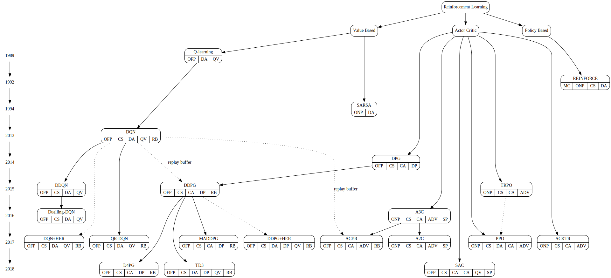

# RL Timeline and Classification

This is a loose timeline and classification of RL algorithms/agents/models mainly by its learning methods:
- value based
- policy based
- actor critic

Additional agent labels are:
- Model-Based (MB)
- Monte Carlo (MC)
- On-Policy (ONP)
- Off-Policy (OFP)
- Discrete action space (DA)
- Continuous action space (CA)
- Discrete state space (DS)
- Continuous state space (CS)
- Stochastic Policy (SP)
- Deterministic Policy (DP)
- Q-Value (QV)
- Advantage (ADV)
- Replay Buffer (RB)

## Reinforcement Learning
Reinforcement learning (RL) is an area of machine learning concerned with how software agents ought to take actions in an environment in order to maximize the notion of cumulative reward [from Wikipedia]

### Value Based
The algorithm contains value function to estimate the value of each state or state-action. The policy is implicit, usually by just selecting the best value

#### SARSA
SARSA (State-Action-Reward-State-Action) is an on-policy TD control method

- Authors: G. A. Rummery, M. Niranjan
- Year: 1994
- Paper: http://citeseerx.ist.psu.edu/viewdoc/download?doi=10.1.1.17.2539&rep=rep1&type=pdf
- Flags:
  - On-Policy (ONP)
  - Discrete action space (DA)

#### Q-learning
Q-learning an off-policy TD control method. Unlike SARSA, it doesn't follow the policy to find the next action but rather chooses most optimal action in a greedy fashion

- Authors: Chris Watkins
- Year: 1989
- Paper: http://www.cs.rhul.ac.uk/~chrisw/new_thesis.pdf
- Useful links: [freecodecamp.org](https://www.freecodecamp.org/news/diving-deeper-into-reinforcement-learning-with-q-learning-c18d0db58efe/), [medium.com](https://medium.com/emergent-future/simple-reinforcement-learning-with-tensorflow-part-0-q-learning-with-tables-and-neural-networks-d195264329d0)
- Flags:
  - Off-Policy (OFP)
  - Discrete action space (DA)
  - Q-Value (QV)

#### DQN
Deep Q Network. Q-Learning with using deep neural network as value estimator

- Authors: Volodymyr Mnih, Koray Kavukcuoglu, David Silver, Alex Graves, Ioannis Antonoglou, Daan Wierstra, Martin Riedmiller
- Year: 2013
- Paper: https://arxiv.org/abs/1312.5602
- Useful links: [towardsdatascience.com](https://towardsdatascience.com/deep-q-learning-for-the-cartpole-44d761085c2f), [freecodecamp.org](https://www.freecodecamp.org/news/an-introduction-to-deep-q-learning-lets-play-doom-54d02d8017d8/)
- Flags:
  - Off-Policy (OFP)
  - Continuous state space (CS)
  - Discrete action space (DA)
  - Q-Value (QV)
  - Replay Buffer (RB)

#### DDQN
Double DQN adds another neural network, making separate network for policy and target. The target network is only updated after certain number of steps/episodes. This makes the learning more stable.

- Authors: Hado van Hasselt, Arthur Guez, David Silver
- Year: 2015
- Paper: https://arxiv.org/abs/1509.06461
- Useful links: [towardsdatascience.com](https://towardsdatascience.com/deep-q-learning-for-the-cartpole-44d761085c2f)
- Flags:
  - Off-Policy (OFP)
  - Continuous state space (CS)
  - Discrete action space (DA)
  - Q-Value (QV)

#### Duelling-DQN
Duelling DQN represents two separate estimators: one for the state value function and one for the state-dependent action advantage function. The main benefit of this factoring is to generalize learning across actions without imposing any change to the underlying reinforcement learning algorithm.

- Authors: Ziyu Wang, Tom Schaul, Matteo Hessel, Hado van Hasselt, Marc Lanctot, Nando de Freitas
- Year: 2016
- Paper: https://arxiv.org/abs/1511.06581
- Flags:
  - Off-Policy (OFP)
  - Continuous state space (CS)
  - Discrete action space (DA)
  - Q-Value (QV)

#### QR-DQN
Distributional Reinforcement Learning with Quantile Regression (QR-DQN). In QR-DQN, distribution of values values are used for each state-action pair instead of a single mean value

- Authors: Will Dabney, Mark Rowland, Marc G. Bellemare, Rémi Munos
- Year: 2017
- Paper: https://arxiv.org/abs/1710.10044
- Useful links: [github.com](https://github.com/senya-ashukha/quantile-regression-dqn-pytorch)
- Flags:
  - Off-Policy (OFP)
  - Continuous state space (CS)
  - Discrete action space (DA)
  - Q-Value (QV)
  - Replay Buffer (RB)

#### DQN+HER
DQN with Hindsight Experience Replay (HER)

- Authors: Marcin Andrychowicz, Filip Wolski, Alex Ray, Jonas Schneider, Rachel Fong, Peter Welinder, Bob McGrew, Josh Tobin, Pieter Abbeel, Wojciech Zaremba
- Year: 2017
- Paper: https://arxiv.org/abs/1707.01495
- Useful links: [becominghuman.ai](https://becominghuman.ai/learning-from-mistakes-with-hindsight-experience-replay-547fce2b3305)
- Flags:
  - Off-Policy (OFP)
  - Continuous state space (CS)
  - Discrete action space (DA)
  - Q-Value (QV)
  - Replay Buffer (RB)

### Actor Critic
Combination of policy-based and value-based. The agent works by directly optimizing the policy, but by using value function to measure how good the policy is

#### DPG
Deterministic Policy Gradient. Abstract: In this paper we consider deterministic policy gradient algorithms for reinforcement learning with continuous actions. The deterministic policy gradient has a particularly appealing form: it is the expected gradient of the action-value function. This simple form means that the deterministic policy gradient can be estimated much more efficiently than the usual stochastic policy gradient. To ensure adequate exploration, we introduce an off-policy actor-critic algorithm that learns a deterministic target policy from an exploratory behaviour policy. We demonstrate that deterministic policy gradient algorithms can significantly outperform their stochastic counterparts in high-dimensional action spaces.

- Authors: David Silver, Guy Lever, Nicolas Heess, Thomas Degris, Daan Wierstra, Martin Riedmiller
- Year: 2014
- Paper: http://proceedings.mlr.press/v32/silver14.pdf
- Flags:
  - Off-Policy (OFP)
  - Continuous state space (CS)
  - Continuous action space (CA)
  - Deterministic Policy (DP)

#### DDPG
Deep Deterministic Policy Gradient.

- Authors: Timothy P. Lillicrap, Jonathan J. Hunt, Alexander Pritzel, Nicolas Heess, Tom Erez, Yuval Tassa, David Silver, Daan Wierstra
- Year: 2015
- Paper: https://arxiv.org/abs/1509.02971
- Useful links: [openai.com](https://spinningup.openai.com/en/latest/algorithms/ddpg.html), [github.io](https://pemami4911.github.io/blog/2016/08/21/ddpg-rl.html)
- Flags:
  - Off-Policy (OFP)
  - Continuous state space (CS)
  - Continuous action space (CA)
  - Deterministic Policy (DP)
  - Replay Buffer (RB)

#### TD3
Twin Delayed DDPG (TD3). TD3 addresses function approximation error in DDPG by introducing twin Q-value approximation network and less frequent updates

- Authors: Scott Fujimoto, Herke van Hoof, David Meger
- Year: 2018
- Paper: https://arxiv.org/abs/1802.09477
- Useful links: [openai.com](https://spinningup.openai.com/en/latest/algorithms/td3.html)
- Flags:
  - Off-Policy (OFP)
  - Continuous state space (CS)
  - Discrete action space (DA)
  - Deterministic Policy (DP)
  - Q-Value (QV)
  - Replay Buffer (RB)

#### MADDPG
Multi-agent DDPG (MADDPG) extends DDPG to an environment where multiple agents are coordinating to complete tasks with only local information. In the viewpoint of one agent, the environment is non-stationary as policies of other agents are quickly upgraded and remain unknown. MADDPG is an actor-critic model redesigned particularly for handling such a changing environment and interactions between agents (source: [Lilian Weng blog](https://lilianweng.github.io/lil-log/2018/04/08/policy-gradient-algorithms.html#reinforce))

- Authors: Ryan Lowe, Yi Wu, Aviv Tamar, Jean Harb, Pieter Abbeel, Igor Mordatch
- Year: 2017
- Paper: https://arxiv.org/abs/1706.02275
- Flags:
  - Off-Policy (OFP)
  - Continuous state space (CS)
  - Continuous action space (CA)
  - Deterministic Policy (DP)
  - Replay Buffer (RB)

#### D4PG
Distributed Distributional Deep Deterministic Policy Gradient (D4PG) adopts the very successful distributional perspective on reinforcement learning and adapts it to the continuous control setting. It combines this within a distributed framework. It also combines this technique with a number of additional, simple improvements such as the use of N-step returns and prioritized experience replay

- Authors: Gabriel Barth-Maron, Matthew W. Hoffman, David Budden, Will Dabney, Dan Horgan, Dhruva TB, Alistair Muldal, Nicolas Heess, Timothy Lillicrap
- Year: 2018
- Paper: https://arxiv.org/abs/1804.08617
- Flags:
  - Off-Policy (OFP)
  - Continuous state space (CS)
  - Continuous action space (CA)
  - Deterministic Policy (DP)
  - Replay Buffer (RB)

#### DDPG+HER
Hindsight Experience Replay (HER)

- Authors: Marcin Andrychowicz, Filip Wolski, Alex Ray, Jonas Schneider, Rachel Fong, Peter Welinder, Bob McGrew, Josh Tobin, Pieter Abbeel, Wojciech Zaremba
- Year: 2017
- Paper: https://arxiv.org/abs/1707.01495
- Useful links: [becominghuman.ai](https://becominghuman.ai/learning-from-mistakes-with-hindsight-experience-replay-547fce2b3305)
- Flags:
  - Off-Policy (OFP)
  - Continuous state space (CS)
  - Discrete action space (DA)
  - Deterministic Policy (DP)
  - Q-Value (QV)
  - Replay Buffer (RB)

#### TRPO
Trust Region Policy Optimization

- Authors: John Schulman, Sergey Levine, Philipp Moritz, Michael I. Jordan, Pieter Abbeel
- Year: 2015
- Paper: https://arxiv.org/pdf/1502.05477
- Useful links: [medium.com](https://medium.com/@jonathan_hui/rl-trust-region-policy-optimization-trpo-explained-a6ee04eeeee9), [medium.com](https://medium.com/@jonathan_hui/rl-trust-region-policy-optimization-trpo-part-2-f51e3b2e373a)
- Flags:
  - On-Policy (ONP)
  - Continuous state space (CS)
  - Continuous action space (CA)
  - Advantage (ADV)

#### A3C
Asynchronous Advantage Actor-Critic (A3C)

- Authors: Volodymyr Mnih, Adrià Puigdomènech Badia, Mehdi Mirza, Alex Graves, Timothy P. Lillicrap, Tim Harley, David Silver, Koray Kavukcuoglu
- Year: 2016
- Paper: https://arxiv.org/abs/1602.01783
- Useful links: [medium.com](https://medium.com/emergent-future/simple-reinforcement-learning-with-tensorflow-part-8-asynchronous-actor-critic-agents-a3c-c88f72a5e9f2), [github.com](https://github.com/dennybritz/reinforcement-learning/tree/master/PolicyGradient/a3c)
- Flags:
  - On-Policy (ONP)
  - Continuous state space (CS)
  - Continuous action space (CA)
  - Advantage (ADV)
  - Stochastic Policy (SP)

#### A2C
A2C is a synchronous, deterministic variant of Asynchronous Advantage Actor Critic (A3C). It uses multiple workers to avoid the use of a replay buffer.

- Authors: OpenAI
- Year: 2017
- Paper: https://openai.com/blog/baselines-acktr-a2c/
- Useful links: [openai.com](https://openai.com/blog/baselines-acktr-a2c/), [freecodecamp.org](https://www.freecodecamp.org/news/an-intro-to-advantage-actor-critic-methods-lets-play-sonic-the-hedgehog-86d6240171d/), [readthedocs.io](https://stable-baselines.readthedocs.io/en/master/modules/a2c.html)
- Flags:
  - On-Policy (ONP)
  - Continuous state space (CS)
  - Continuous action space (CA)
  - Advantage (ADV)
  - Stochastic Policy (SP)

#### ACER
Sample Efficient Actor-Critic with Experience Replay (ACER) combines several ideas of previous algorithms: it uses multiple workers (as A2C), implements a replay buffer (as in DQN), uses Retrace for Q-value estimation, importance sampling and a trust region.

- Authors: Ziyu Wang, Victor Bapst, Nicolas Heess, Volodymyr Mnih, Remi Munos, Koray Kavukcuoglu, Nando de Freitas
- Year: 2017
- Paper: https://arxiv.org/abs/1611.01224
- Flags:
  - Off-Policy (OFP)
  - Continuous state space (CS)
  - Continuous action space (CA)
  - Advantage (ADV)
  - Replay Buffer (RB)

#### ACKTR
Actor Critic using Kronecker-Factored Trust Region (ACKTR) is applying trust region optimization to deep reinforcement learning using a recently proposed Kronecker-factored approximation to the curvature.

- Authors: Yuhuai Wu, Elman Mansimov, Shun Liao, Roger Grosse, Jimmy Ba
- Year: 2017
- Paper: https://arxiv.org/abs/1708.05144
- Flags:
  - On-Policy (ONP)
  - Continuous state space (CS)
  - Continuous action space (CA)
  - Advantage (ADV)

#### PPO
Proximal Policy Optimization. We're releasing a new class of reinforcement learning algorithms, Proximal Policy Optimization (PPO), which perform comparably or better than state-of-the-art approaches while being much simpler to implement and tune. PPO has become the default reinforcement learning algorithm at OpenAI because of its ease of use and good performance (OpenAI)

- Authors: John Schulman, Filip Wolski, Prafulla Dhariwal, Alec Radford, Oleg Klimov
- Year: 2017
- Paper: https://arxiv.org/abs/1707.06347
- Useful links: [openai.com](https://spinningup.openai.com/en/latest/algorithms/ppo.html), [openai.com](https://openai.com/blog/openai-baselines-ppo/)
- Videos: [youtube.com](https://www.youtube.com/watch?v=5P7I-xPq8u8)
- Flags:
  - On-Policy (ONP)
  - Continuous state space (CS)
  - Discrete action space (DA)
  - Continuous action space (CA)
  - Advantage (ADV)

#### SAC
Soft Actor Critic (SAC) is an algorithm that optimizes a stochastic policy in an off-policy way, forming a bridge between stochastic policy optimization and DDPG-style approaches.

- Authors: Tuomas Haarnoja, Aurick Zhou, Pieter Abbeel, Sergey Levine
- Year: 2018
- Paper: https://arxiv.org/abs/1801.01290
- Useful links: [openai.com](https://spinningup.openai.com/en/latest/algorithms/sac.html)
- Flags:
  - Off-Policy (OFP)
  - Continuous state space (CS)
  - Continuous action space (CA)
  - Continuous action space (CA)
  - Q-Value (QV)
  - Stochastic Policy (SP)

### Policy Based
The algorithm stores the policy and works directly to optimize the policy without estimating the state or state-action values

- Useful links: [medium.com](https://medium.com/@jonathan_hui/rl-policy-gradients-explained-9b13b688b146), [freecodecamp.org](https://www.freecodecamp.org/news/an-introduction-to-policy-gradients-with-cartpole-and-doom-495b5ef2207f/)

#### REINFORCE
REINFORCE (Monte-Carlo policy gradient). The agent collects a trajectory of one episode using its current policy, and uses the returns to update the policy parameter

- Authors: Ronald J. Williams
- Year: 1992
- Paper: https://people.cs.umass.edu/~barto/courses/cs687/williams92simple.pdf
- Useful links: [toronto.edu](http://www.cs.toronto.edu/~tingwuwang/REINFORCE.pdf), [freecodecamp.org](https://www.freecodecamp.org/news/an-introduction-to-policy-gradients-with-cartpole-and-doom-495b5ef2207f/)
- Flags:
  - Monte Carlo (MC)
  - On-Policy (ONP)
  - Continuous state space (CS)
  - Discrete action space (DA)

(This document is autogenerated)
